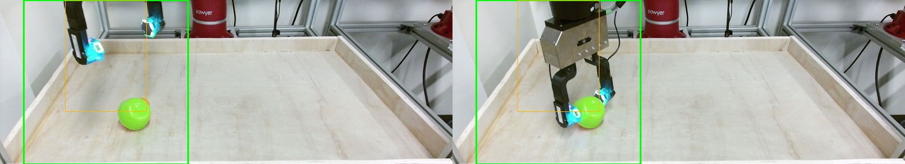
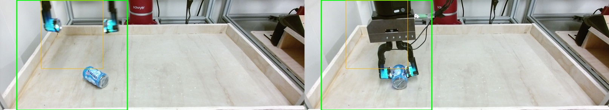
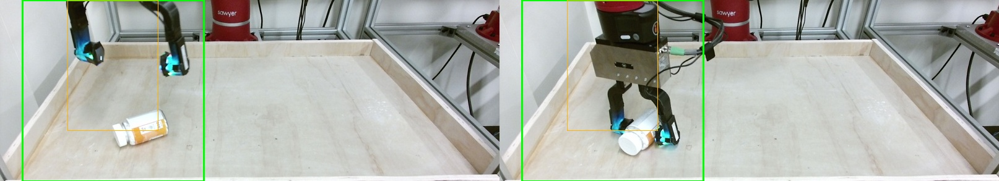

# Study: The Value Of Tactile Sensors In Grasp Prediction

**This study and code is owned by Adwait Dongare and may not be used for any purposes unless explicitly allowed.**

This document describes the research question, detector design, results, and interpretation. For the commands to preprocess data, train models, and run evaluation, see [README.md](README.md).

## Question

Does tactile sensing improve a robotic grasping system's ability to predict whether it will grasp and hold an object?

The core comparison is:

- **Vision-only:** RGB images before/during grasp.
- **Tactile-only:** GelSight images before/during grasp.
- **Fusion:** RGB images + GelSight images before/during grasp.

The primary hypothesis is that tactile sensing improves grasp outcome prediction over vision alone. The secondary hypothesis is that this advantage should be larger on visually challenging objects, where RGB has weaker cues about texture, material, transparency, reflectance, or contact-relevant geometry.

## Dataset And Model Recommendations

The primary dataset is [Feeling of Success](https://sites.google.com/view/the-feeling-of-success), which provides paired RGB, GelSight tactile images, and grasp success/failure labels.

The data archive used for this study is [h5.zip](https://opara.zih.tu-dresden.de/bitstreams/4ef8383c-bcae-4bf6-9bcd-1242488624b5/download).

For tactile sensing, the recommended starting point is a pretrained tactile encoder from [Sparsh](https://github.com/facebookresearch/sparsh.git) followed by a small MLP head. Sparsh already understands GelSight-style tactile images, so the tactile preprocessing burden is light; in this repo, image rotation and tensor preparation are handled inside the detector code.

For vision sensing, the detector uses [vit_base_patch16_224.augreg_in21k](https://huggingface.co/timm/vit_base_patch16_224.augreg_in21k). This model expects 224x224 RGB inputs, so the vision preprocessing tries to preserve aspect ratio and object detail by using a square crop around pre-outcome motion.

## Preprocessing Summary

The preprocessing pipeline converts the H5 archive into one folder per sample, adds RGB motion-difference crop metadata, and creates deterministic train/eval/test splits.

The RGB crop uses only `before` and `during` frames, finds the strongest pre-outcome motion region, and stores a full-height square crop in `metadata.json` under `rgb_motion_diff`.

This crop is important for a fairer vision comparison. The RGB frames are wide, while the vision backbone expects 224x224 inputs. A naive resize would shrink the object and gripper interaction region, making the vision baseline weaker for reasons unrelated to touch. The motion-based crop is relatively quick to compute gives the vision model a focused view of the likely grasp interaction in the feeling of success dataset while preserving aspect ratio and most of the details.

Example motion-based crop boxes:





The visually challenging subset is defined by object membership in [possibly-visually-difficult.csv](possibly-visually-difficult.csv). It is not a separate train/eval/test split.

## Detector Design

All detectors use only `before` and `during` frames. The `after` frame is excluded because it can leak the outcome.

### Tactile-Only

`tactile-detector.py` uses frozen `facebook/sparsh-dino-base` weights from:

```text
checkpoints/sparsh-dino-base/dino_vitbase.safetensors
```

The model concatenates GelSight `before` and `during` RGB images into a 6-channel input. The frozen Sparsh ViT produces a 768-dimensional tactile embedding, and the classifier head is:

```text
768 -> 192 -> 2
```

### Vision-Only

`vision-detector.py` uses:

```text
vit_base_patch16_224.augreg_in21k
```

The frozen ViT encodes RGB `during` and `before` frames independently. Their 768-dimensional embeddings are concatenated into a 1536-dimensional input. It concatenates:

```text
vision_during          768
vision_before          768
--------------------------
fusion input          1536
```


The classifier head is:

```text
1536 -> 384 -> 2
```

### Fusion

`joint-detector.py` is a late-fusion model. It concatenates:

```text
tactile_embedding      768
vision_during          768
vision_before          768
--------------------------
fusion input          2304
```

The classifier head is:

```text
2304 -> 1152 -> 2
```

## Test Results

We have consistently split up the dataset into training, evaluation and test splits for all detector training. We use object-level splitting so as to not leak any unexpected visual information to the detector. 

Hashes for the split files:

| file | sha256 |
|---|---|
| `feeling-of-success/manifest.csv` | `f61ab4dcd4a4536822d9699a418ea6d4a5a9016d66df89bf8163ecae12592ca3` |
| `feeling-of-success/train.csv` | `fff2351c634696781977e7f14fe218ddc5910ae998fe1cf4ad52867cbc223fc9` |
| `feeling-of-success/eval.csv` | `886846932990fc500b2735c928132c3f93466ce13deaaf8c38cd3df6bd2cec99` |
| `feeling-of-success/test.csv` | `ef8bdbd72beb872b8617974bf3a305007ee465c29d80c4d816fffb802e729c92` |

Results:

| subset | detector | n | accuracy | macro F1 | AUROC |
|---|---:|---:|---:|---:|---:|
| all | vision | 1185 | 0.7477 | 0.6731 | 0.6892 |
| all | tactile | 1185 | 0.8819 | 0.8554 | 0.9337 |
| all | fusion | 1185 | 0.8321 | 0.7991 | 0.8776 |
| visually challenging | vision | 99 | 0.7778 | 0.6265 | 0.7002 |
| visually challenging | tactile | 99 | 0.9091 | 0.8279 | 0.9866 |
| visually challenging | fusion | 99 | 0.8586 | 0.7514 | 0.8870 |

Headline accuracy lifts:

| subset | vision acc | tactile acc | fusion acc | tactile_lift | fusion_lift |
|---|---:|---:|---:|---:|---:|
| all | 0.7477 | 0.8819 | 0.8321 | 0.1342 | 0.0844 |
| visually challenging | 0.7778 | 0.9091 | 0.8586 | 0.1313 | 0.0808 |

Confusion matrices are ordered as rows = ground truth `[failure, success]`, columns = prediction `[failure, success]`.

| subset | detector | confusion matrix |
|---|---|---|
| all | vision | `[[160, 171], [128, 726]]` |
| all | tactile | `[[269, 62], [78, 776]]` |
| all | fusion | `[[253, 78], [121, 733]]` |
| visually challenging | vision | `[[7, 5], [17, 70]]` |
| visually challenging | tactile | `[[11, 1], [8, 79]]` |
| visually challenging | fusion | `[[10, 2], [12, 75]]` |

## Optional Full-Dataset Analysis

This combines train, eval, and test prediction CSVs in memory for analysis only. It is useful for debugging trends but should not replace held-out test results.

| subset | detector | n | accuracy | macro F1 | AUROC |
|---|---:|---:|---:|---:|---:|
| all | vision | 9296 | 0.7781 | 0.7566 | 0.8285 |
| all | tactile | 9296 | 0.8541 | 0.8366 | 0.9269 |
| all | fusion | 9296 | 0.8816 | 0.8705 | 0.9401 |
| visually challenging | vision | 2353 | 0.8062 | 0.7842 | 0.8699 |
| visually challenging | tactile | 2353 | 0.8819 | 0.8661 | 0.9469 |
| visually challenging | fusion | 2353 | 0.8993 | 0.8874 | 0.9517 |

## Interpreting The Results

### Where Tactile Beats Vision

- Tactile beats vision most clearly when success depends on contact quality rather than object identity.
- Soft or compliant examples include `plastic_chicken`, `egg_crate_foam`, `creamy_petroleum_jelly` and `fox_head`.
- Low-texture or visually bland examples include `creamy_petroleum_jelly`, `board_eraser`, and `3d_printed_white_ball`.
- Small or awkward examples include `set_small_plastic_men_red_racer`.
- Container examples include `playdoh_container`, `tomato_paste_in_metal_can`, and `isopropyl_alcohol`. I suspect the weight of the object might play a role here.
- The likely mechanism is that RGB can identify the object and pose, but it cannot directly observe whether the gripper made stable enough contact to lift it
- GelSight gives direct evidence about contact geometry, local deformation, and whether the grasp has seated.

### Where Tactile Does Not

- I do not see a strong held-out object category where vision beats tactile overall.
- The limitation is sample-level: vision is correct while tactile is wrong on some individual trials.
- In the test split, vision is correct while tactile is wrong on 82 / 1185 samples, or about 6.9%.
- Likely causes are weak tactile contact, noisy GelSight frames, contact outside the informative part of the sensor, or visually obvious pose cues.
- Fusion also does not consistently beat tactile on the held-out test split.
- This suggests the simple concatenation head may over-trust vision or fail to learn when touch is the more reliable modality.

### Proxy-Dataset Validity

Feeling of Success is a directionally useful proxy, not a final benchmark for Monty.

- It is useful because it tests the relevant structure of the problem: paired RGB and tactile observations predicting grasp success.
- The result supports the thesis that contact information closes a real gap left by vision.
- It is not a production-valid estimate because the tactile sensor, gripper, object mix, camera viewpoint, and data collection protocol differ from Monty's real setup.
- I would use these results as evidence to justify an experiment with the real Monty sensors and system, but we cannot yet justify that Monty can successfully grasp objects just because it has access to tactile sensors.

### Next Experiment

The next experiments with the current proxy dataset should focus information we have not left out and on the weaknesses suggested by these runs:

- **Use both GelSight sensors more explicitly.** The current tactile setup samples one GelSight stream under a sensor policy. A stronger tactile baseline should concatenate embeddings from both GelSight sensors so the head can reason about contact and grip from both sides of the grasp.
- **Reduce vision overfitting.** The vision detector showed strong train accuracy but weaker eval/test behavior. I would try a narrower MLP head, stronger regularization, or earlier stopping so the vision baseline is not dominated by overfit artifacts.
- **Improve the fusion head.** The current fusion model uses plain concatenation, and on the held-out test split it does not beat tactile. A better fusion head should learn when to trust touch over vision, possibly with modality dropout, gating, or confidence-aware fusion.

The next experiment with real Monty tactile data should keep the same comparison contract: vision-only, tactile-only, and fusion on the same grouped split with the same metrics. I would especially include visually challenging objects, but the first goal would be to test whether the tactile lift observed in this proxy dataset transfers to Monty's own sensor and grasp setup.
